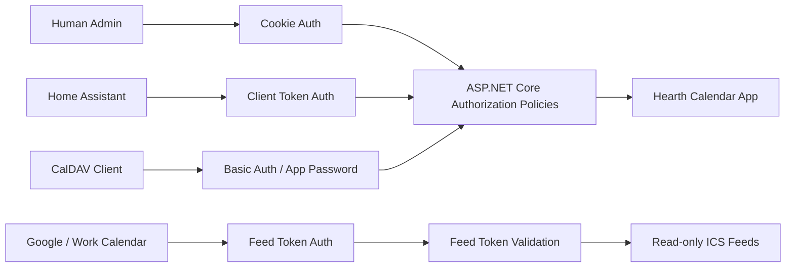

# Hearth Calendar Auth Stack

This document defines the first authentication and authorization model for Hearth Calendar.

The goal is to keep the app secure by default without overbuilding a full identity platform before the product needs it.

## Principles

- Human admin access, machine write access, and read-only feed access are separate.
- PostgreSQL, through Marten, stores credential metadata and hashed secrets.
- Raw secrets and tokens are shown once at creation time and are never stored.
- Endpoints require authorization by default unless explicitly marked anonymous.
- Every token should be scoped, revocable, and attributable to a client.
- Calendar policy remains in the domain. Auth decides who may ask for an action, not whether the calendar action is safe.

## Auth Lanes



### Human Admin Auth

Human users access the web UI with cookie-based authentication.

Initial approach:

- one or more admin users supplied through configuration
- passwords stored as PBKDF2-SHA256 hashes
- cookie sessions for the review/admin UI

Potential later upgrade:

- admin users stored in Marten with lifecycle metadata
- external identity provider through OpenID Connect
- Microsoft, Google, or another family-managed provider
- richer roles if the app grows beyond simple admin usage

The initial implementation should avoid full ASP.NET Identity unless the app needs registration, password reset, external login management, or a richer account lifecycle.

### Machine Write Auth

Machine clients use scoped app credentials.

Examples:

- `home-assistant`
- `onecalendar-windows`
- `davx5-android`
- `adult-a-phone`
- `import-worker`

Each client credential has its own secret, scopes, lifecycle, and audit trail.

Home Assistant should only have the scope needed to submit calendar intent. It should not have feed, admin, or broad calendar-management privileges.

### Feed Token Auth

Read-only ICS feeds use separate feed tokens.

Feed tokens are not valid for write endpoints, admin endpoints, or CalDAV endpoints.

Example feed URLs:

```text
GET /feeds/combined.ics?token=...
GET /feeds/adult-a.ics?token=...
GET /feeds/adult-b.ics?token=...
GET /feeds/child.ics?token=...
GET /feeds/family.ics?token=...
GET /feeds/events.ics?token=...
```

Feed tokens may be scoped to:

- a single virtual calendar
- a group of virtual calendars
- a specific consumer, such as `adult-a-work-calendar`

## Authentication Methods

| Method | Used By | Credential Shape | Notes |
| --- | --- | --- | --- |
| Cookie auth | Web UI admins | username/password -> session cookie | V1 human/admin path. |
| Bearer/app token | Home Assistant, API clients | opaque token | Good for JSON HTTP APIs. |
| Basic auth app password | CalDAV clients | client id + app password | Useful because many CalDAV clients expect Basic auth. |
| Query token | ICS feed consumers | opaque feed token | Acceptable for calendar feed subscription URLs. |

## Authorization Scopes

Initial scopes:

| Scope | Allows |
| --- | --- |
| `admin:web` | Use admin/review web UI. |
| `intake:write` | Submit event intent through HTTP intake endpoints. |
| `caldav:write` | Submit event intent through writable Smart Inbox CalDAV. |
| `caldav:read` | Read virtual calendars through CalDAV. |
| `feed:combined` | Read combined ICS feed. |
| `feed:adult-a` | Read Adult A ICS feed. |
| `feed:adult-b` | Read Adult B ICS feed. |
| `feed:child` | Read Child ICS feed. |
| `feed:family` | Read Family ICS feed. |
| `feed:events` | Read Events ICS feed. |
| `credentials:manage` | Create, rotate, and revoke app/feed credentials. |

V1 can implement this as simple string scopes on credential documents. It does not need a complex role hierarchy.

## Endpoint Policy Map

| Endpoint | Auth | Required Scope / Policy |
| --- | --- | --- |
| `GET /health` | Anonymous | None. |
| `POST /api/admin/login` | Anonymous | Valid configured admin username/password. |
| `POST /api/admin/logout` | Admin cookie | `admin:web`. |
| `GET /api/admin/session` | Admin cookie | `admin:web`. |
| `GET /` and Blazor fallback routes | Anonymous | App shell only; protected data still requires admin cookie. |
| BluQube UI commands and queries | Admin cookie | `admin:web`. |
| `POST /api/intake/event` | Client token | `intake:write`. |
| `POST /api/intake/home-assistant/event` | Client token | `intake:write`. |
| `GET /feeds/{calendar}.ics` | Feed token | matching `feed:*` scope. |
| `PROPFIND /caldav/*` | CalDAV auth | `caldav:read` or `caldav:write`. |
| `PUT /caldav/*` | CalDAV auth | `caldav:write`. |
| `DELETE /caldav/*` | CalDAV auth | `caldav:write`, then exact-match delete policy. |

The app should use ASP.NET Core fallback authorization so new endpoints are protected unless explicitly configured otherwise.

BluQube commands and queries used by the Blazor WebAssembly UI should also require authorization by default through BluQube authorization. Anonymous BluQube requests, such as a future login/bootstrap command, must be explicitly marked.

## Credential Documents

### Admin User

```csharp
public sealed record AdminUserDocument
{
    public required string Id { get; init; }
    public required string DisplayName { get; init; }
    public required string Username { get; init; }
    public required string PasswordHash { get; init; }
    public required IReadOnlyList<string> Scopes { get; init; }
    public required Instant CreatedAt { get; init; }
    public Instant? LastLoginAt { get; init; }
    public Instant? DisabledAt { get; init; }
}
```

### Client Credential

```csharp
public sealed record ClientCredentialDocument
{
    public required string Id { get; init; }
    public required string DisplayName { get; init; }
    public required string SecretHash { get; init; }
    public required IReadOnlyList<string> Scopes { get; init; }
    public required CalendarSource Source { get; init; }
    public required Instant CreatedAt { get; init; }
    public Instant? LastUsedAt { get; init; }
    public Instant? RevokedAt { get; init; }
}
```

### Feed Token

```csharp
public sealed record FeedTokenDocument
{
    public required string Id { get; init; }
    public required string DisplayName { get; init; }
    public required string TokenHash { get; init; }
    public required IReadOnlyList<VirtualCalendarId> Calendars { get; init; }
    public required IReadOnlyList<string> Scopes { get; init; }
    public required Instant CreatedAt { get; init; }
    public Instant? LastUsedAt { get; init; }
    public Instant? RevokedAt { get; init; }
}
```

## Token Handling

Token requirements:

- generate high-entropy random tokens
- store only a hash of the token
- show raw token only once at creation
- support revocation without deleting audit history
- record `LastUsedAt` for operational visibility
- avoid logging raw tokens

Recommended token prefixes:

```text
hc_client_...
hc_feed_...
```

Prefixes make logs and support conversations easier without exposing privilege or identity.

## Credential Management UI

Admin users can manage machine credentials from the web UI after signing in.

The management surface supports:

- listing client credential, feed token, and CalDAV app-password metadata
- creating new credentials
- rotating existing secrets
- revoking credentials without deleting their audit trail

The UI must never display stored hashes and must never read a raw secret back from storage. Create and rotate commands return the generated secret in the command response only. The browser displays that value until the admin dismisses it, signs out, refreshes, or runs another credential action.

Operational handling:

- copy generated secrets directly into the target client or a local secret manager
- do not put generated secrets, bearer tokens, feed URLs with tokens, or app passwords in repository files, issue comments, screenshots, logs, or docs
- keep `appsettings.json` examples as placeholders only
- use environment variables, user secrets, deployment secrets, or the credential-management UI for real values
- rotate any credential that may have been exposed
- prefer separate credentials per device or integration so revocation is narrow

## Authorization And Domain Safety

Authorization answers:

> Is this actor allowed to request this operation?

Domain policy answers:

> Is this calendar operation safe and meaningful?

Examples:

- A client with `intake:write` may submit `delete dentist tomorrow`.
- The domain can still stage or reject the delete if there is no exact match.
- A feed token may read the Adult A feed.
- It can never submit writes even if it knows an event ID.
- AI review may suggest a target calendar.
- Auth and deterministic safety rules still decide whether the request can proceed.

## Security Headers And Hosting Defaults

Adopt deliberately:

- remove unnecessary `Server` header where the hosting layer allows it
- add `X-Content-Type-Options: nosniff`
- add clickjacking protection through CSP `frame-ancestors` or `X-Frame-Options`
- add `Referrer-Policy`
- add `Permissions-Policy` to disable browser capabilities the app does not need
- add HSTS only when HTTPS assumptions are true in the deployment environment

Content Security Policy should be tuned after the UI framework is chosen, especially if Blazor Server is used.

## CORS

CORS controls which browser origins may call the server APIs.

The app should not use wildcard CORS in deployed environments.

Recommended model:

| Environment | Allowed Origins |
| --- | --- |
| local development | explicit localhost origins for the Blazor WASM dev server and ASP.NET Core host |
| home/self-hosted production | the configured public/internal app origin only |
| test/staging | explicit staging origins only |

Apply CORS to:

- BluQube generated endpoints
- SignalR hub endpoint
- explicit HTTP API endpoints such as Home Assistant intake if called from browsers

CORS is usually not relevant to:

- server-to-server Home Assistant calls
- ICS feed subscriptions from calendar services
- CalDAV clients outside browsers

Those still need authentication and rate limiting, but CORS is a browser enforcement boundary.

Configuration shape:

```json
{
  "Auth": {
    "AdminUsers": [
      {
        "Username": "admin",
        "DisplayName": "Calendar Admin",
        "PasswordHash": "pbkdf2-sha256:<iterations>:<salt>:<hash>",
        "Scopes": [ "admin:web" ]
      }
    ]
  },
  "Security": {
    "Cors": {
      "AllowedOrigins": [
        "https://calendar.example.home"
      ]
    }
  }
}
```

Policy requirements:

- allowed origins are configured, not hard-coded
- no `AllowAnyOrigin` outside local-only development
- credentials are allowed only for trusted configured origins
- SignalR origins match the web UI origins
- failed CORS requests should not reveal sensitive endpoint details

## Content Security Policy

CSP controls what the browser is allowed to load, execute, frame, and connect to.

The initial policy should support:

- Blazor WebAssembly assets
- BluQube HTTP calls back to the app origin
- SignalR WebSocket or long-polling connections back to the app origin
- PWA service worker and manifest assets
- CSS and fonts used by the chosen UI framework

Initial production posture:

```text
default-src 'self';
base-uri 'self';
object-src 'none';
frame-ancestors 'none';
img-src 'self' data: blob:;
font-src 'self';
style-src 'self';
script-src 'self';
connect-src 'self';
manifest-src 'self';
worker-src 'self';
form-action 'self';
upgrade-insecure-requests;
```

The app also emits a restrictive `Permissions-Policy` for unused browser capabilities such as camera, microphone, geolocation, payment, and USB access.

The final policy may need adjustment based on:

- Blazor WebAssembly boot/runtime requirements
- whether inline styles are emitted by the UI component library
- whether any third-party font/icon/CDN is introduced
- whether the app is served behind a reverse proxy with a different public origin
- whether SignalR connects over `wss://` to a separate host

Rules:

- avoid third-party scripts by default
- avoid broad `script-src 'unsafe-inline'`
- avoid broad `style-src 'unsafe-inline'` unless a chosen UI library forces a documented exception
- include SignalR endpoints in `connect-src`; prefer explicit origins over broad schemes when SignalR is not same-origin
- include PWA worker support in `worker-src`
- include manifest support in `manifest-src`
- prefer report-only CSP during first UI integration, then enforce after verification

Local development may need a looser policy for hot reload, dev server origins, and WebAssembly debugging. That exception should be environment-specific and not copied into production.

## CORS And CSP Acceptance Criteria

- Production CORS uses an explicit allowed-origin list.
- Production CORS does not use wildcard origin with credentials.
- SignalR hub endpoint uses the same configured CORS origin policy as the WASM UI.
- BluQube generated endpoints are covered by the configured CORS policy.
- Production CSP includes `default-src 'self'`.
- Production CSP blocks framing through `frame-ancestors 'none'` unless embedding is intentionally introduced.
- Production CSP includes SignalR/BluQube endpoints in `connect-src`, using explicit origins when they are not same-origin.
- Production CSP supports PWA manifest and service worker loading.
- Development-only CORS/CSP looseness is isolated by environment.
- CSP changes are verified against login, Blazor boot, BluQube calls, SignalR reconnect, and PWA installation.
- Browser capability permissions are denied by default unless a feature explicitly requires one.

## Audit Events

Auth-sensitive audit actions:

| Action | When |
| --- | --- |
| `AdminLoggedIn` | Successful admin login. |
| `AdminLoginFailed` | Failed admin login, rate-limited/aggregated if noisy. |
| `ClientCredentialCreated` | A machine credential is created. |
| `ClientCredentialRotated` | A machine credential secret is rotated. |
| `ClientCredentialRevoked` | A machine credential is revoked. |
| `FeedTokenCreated` | A feed token is created. |
| `FeedTokenRotated` | A feed token is rotated. |
| `FeedTokenRevoked` | A feed token is revoked. |
| `UnauthorizedRequestRejected` | A non-sensitive summary of rejected auth attempts. |

Audit entries must not include raw passwords, raw tokens, or authorization headers.

## First Implementation Slice

Implement auth in this order:

1. Add fallback authorization.
2. Add admin cookie auth with one seeded admin.
3. Add client token auth for HTTP intake.
4. Add feed token validation for ICS endpoints.
5. Add credential documents and audit entries.
6. Add CalDAV Basic auth/app passwords when CalDAV starts.

## Acceptance Criteria

- New endpoints require authorization by default.
- `GET /health` is explicitly anonymous.
- Admin login is explicitly anonymous and issues an admin cookie only for valid configured credentials.
- Admin session and logout endpoints require an authenticated admin cookie.
- Home Assistant intake requires a client credential with `intake:write`.
- Feed endpoints require a feed token scoped to the requested virtual calendar.
- Feed tokens cannot call write endpoints.
- Client write tokens cannot call admin endpoints.
- Raw tokens/passwords are never stored.
- Token creation, rotation, and revocation are audited.
- Unauthorized requests return `401` or `403` without leaking whether event IDs or calendar IDs exist.
- Auth code does not reference Home Assistant-specific calendar policy.
