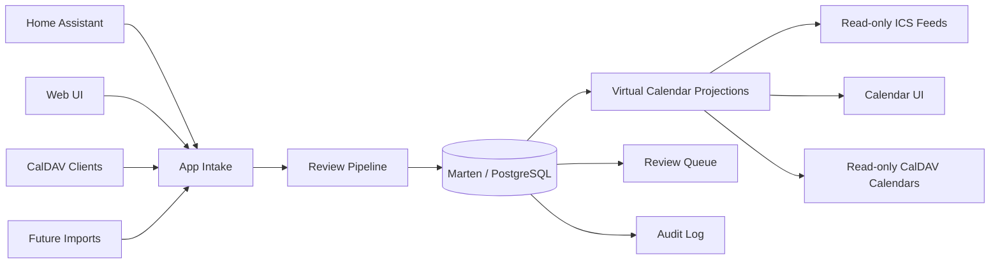
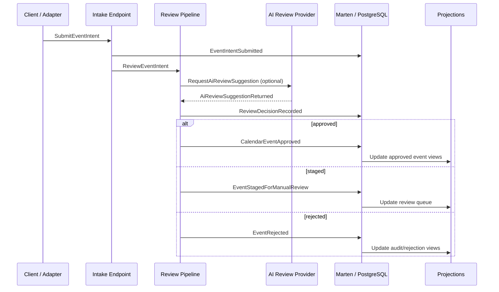
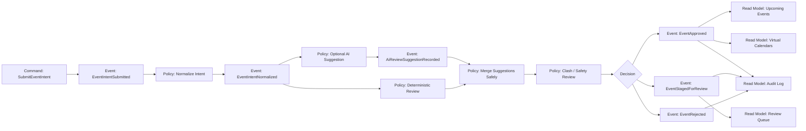
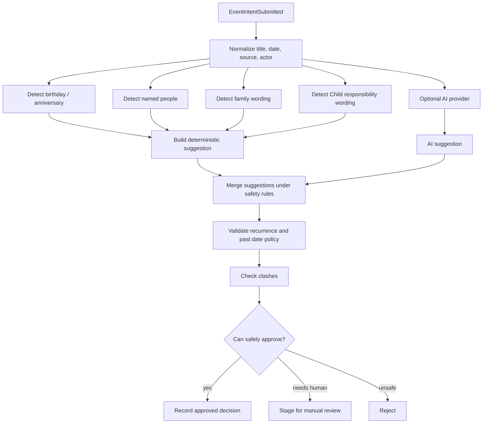
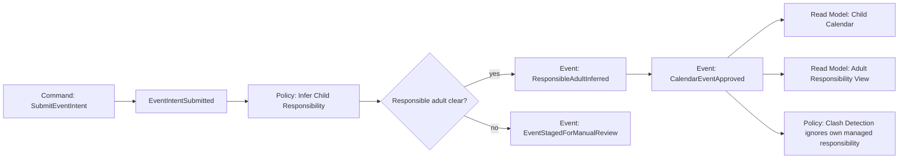
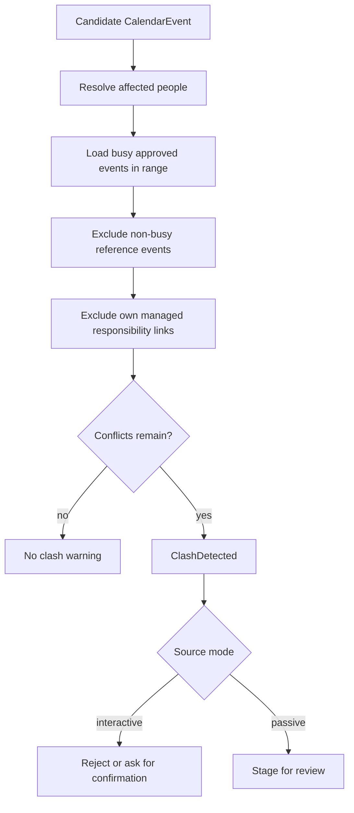
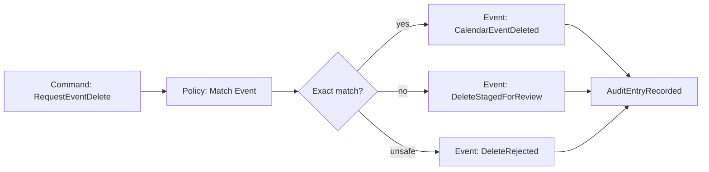
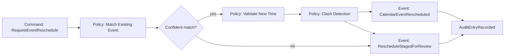
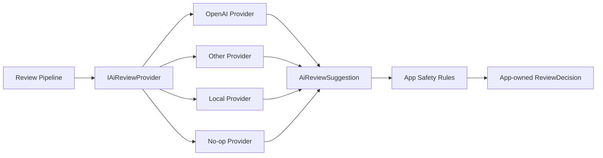

# Hearth Calendar Event Model

This document describes the first domain model for Hearth Calendar using an event modelling style.

The model is intentionally centred on user-visible outcomes:

- calendar intent is submitted
- the app interprets and reviews it
- the app approves, rejects, or stages it
- approved events appear in calendars and feeds
- every meaningful decision is auditable

## Modelling Principles

- PostgreSQL, through Marten, is the source of truth.
- Home Assistant, web UI, CalDAV clients, and future imports are intake adapters.
- ICS and virtual calendars are projections from approved app state.
- AI review is a replaceable suggestion provider, not the decision authority.
- Deterministic rules own final safety decisions such as clashes, deletes, reschedules, recurrence, and permissions.

## System Context



## Event Model Legend

The flows below use these concepts:

- **Command**: a request to do something.
- **Domain Event**: something important that happened.
- **Policy**: logic that reacts to events and decides next commands.
- **Read Model**: queryable view used by UI, feeds, or integrations.
- **External System**: source or consumer outside the app.

## Core Event Timeline



## Primary Workflow: Submit Event Intent

This is the most important first vertical slice.



### Commands

| Command | Actor | Purpose |
| --- | --- | --- |
| `SubmitEventIntent` | Home Assistant, web UI, CalDAV, import | Submit raw or structured calendar intent for app review. |
| `ReviewEventIntent` | System | Run the deterministic and optional AI-assisted review pipeline. |
| `ApproveReviewedEvent` | Admin/user/system | Approve a staged or automatically approved event. |
| `RejectReviewedEvent` | Admin/user/system | Reject an unsafe or unwanted intent. |
| `EditReviewedEvent` | Admin/user | Modify staged event details before approval. |

### Domain Events

| Event | Meaning |
| --- | --- |
| `EventIntentSubmitted` | An adapter submitted calendar intent. |
| `EventIntentNormalized` | The app parsed dates, title, source metadata, and obvious structure. |
| `AiReviewSuggestionRecorded` | A configured AI provider supplied a suggestion. |
| `ReviewDecisionRecorded` | The app decided approved, staged, or rejected with reasons. |
| `CalendarEventApproved` | A calendar event became part of approved app state. |
| `EventStagedForManualReview` | The app could not safely decide automatically. |
| `EventRejected` | The app refused the intent. |
| `AuditEntryRecorded` | A durable audit entry was written. |

### Read Models

| Read Model | Used By | Contains |
| --- | --- | --- |
| `ReviewQueue` | Web UI | Staged intents, suggestions, clashes, and review actions. |
| `UpcomingEvents` | Web UI | Approved future events across selected calendars. |
| `VirtualCalendar` | UI, ICS, CalDAV | Approved events filtered by metadata. |
| `AuditTrail` | Web UI/admin | Decision and change history. |
| `FeedIndex` | ICS endpoints | Active feeds and token metadata. |

## Review Pipeline



### Review Statuses

| Status | Meaning |
| --- | --- |
| `Approved` | The app has enough confidence and no blocking safety issue. |
| `Staged` | Human review is needed before the event becomes visible in calendars/feeds. |
| `Rejected` | The request is unsafe, invalid, unauthorized, or impossible. |

## Policy Matrix

| Input Pattern | Policy | Expected Result |
| --- | --- | --- |
| `Adult B birthday on 25 July` | Birthday routing | Events calendar, yearly recurrence, non-busy, approved. |
| `Our anniversary` | Anniversary routing | Events calendar, yearly recurrence, non-busy, approved or staged if date missing. |
| `Dentist for Adult A` | Personal routing | Adult A calendar, busy, clash checked. |
| `Family BBQ` | Family routing | Family calendar, Adult A/Adult B/Child participants, clash checked. |
| `Child swimming with Adult B` | Child responsibility | Child calendar, Adult B responsible adult, responsibility shadow considered. |
| `dentist` | Ambiguity handling | Staged for review. |
| Past non-reference event | Past event policy | Rejected or staged based on source mode. |
| Past birthday | Reference recurrence policy | Allowed if yearly recurrence can be inferred. |

## Child Responsibility Flow



The responsibility link is domain metadata, not a separate source-of-truth event. Projections may render it as an adult responsibility item where useful, but the relationship must remain traceable to the original Child event.

## Clash Detection Flow



## Delete Flow

Deletes must be exact and auditable.



## Reschedule Flow



## AI Review Provider Boundary



AI review can suggest:

- normalized title
- participants
- target calendar
- responsible adult
- recurrence hint
- ambiguity warnings
- confidence and reasons

AI review must not decide:

- final approval
- clash safety
- authorization
- exact delete matching
- exact reschedule matching
- whether an audit entry is required

## Event Streams And Documents

The first implementation can use Marten document storage with explicit audit entries. Event sourcing can be introduced later if the lifecycle becomes complex enough.

Recommended initial documents:

| Document | Purpose |
| --- | --- |
| `EventIntentDocument` | Submitted raw/structured intent. |
| `CalendarEventDocument` | Approved or staged calendar event candidate. |
| `ReviewDecisionDocument` | App-owned decision and reasons. |
| `AiReviewSuggestionDocument` | Provider-specific suggestion output. |
| `AuditEntryDocument` | Append-only audit trail. |
| `ClientCredentialDocument` | Per-adapter/client credentials. |
| `FeedTokenDocument` | Read-only feed tokens. |

Potential future event streams:

| Stream | Events |
| --- | --- |
| `intent-{id}` | Submitted, normalized, reviewed. |
| `event-{id}` | Approved, edited, rescheduled, deleted. |
| `review-{id}` | Staged, approved, rejected, comments added. |
| `credential-{id}` | Created, rotated, revoked. |

## First Slice

The first build slice should prove this path:

```text
POST /api/intake/event
  -> EventIntentSubmitted
  -> deterministic review
  -> optional no-op AI suggestion
  -> ReviewDecisionRecorded
  -> CalendarEventApproved or EventStagedForManualReview
  -> audit entry
  -> upcoming events or review queue read model
```

Acceptance criteria:

- The app can accept an event intent without any external calendar dependency.
- Birthday, personal, family, Child responsibility, ambiguity, and clash examples are covered by tests.
- AI review can be disabled or swapped without changing domain logic.
- Approved events are queryable by virtual calendar.
- Staged events appear in the review queue.
- Rejected events do not appear in feeds or approved calendar views.
