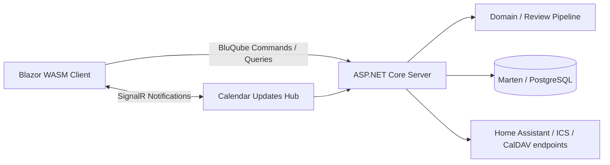
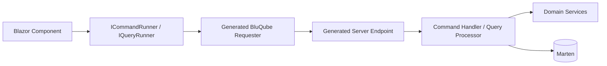
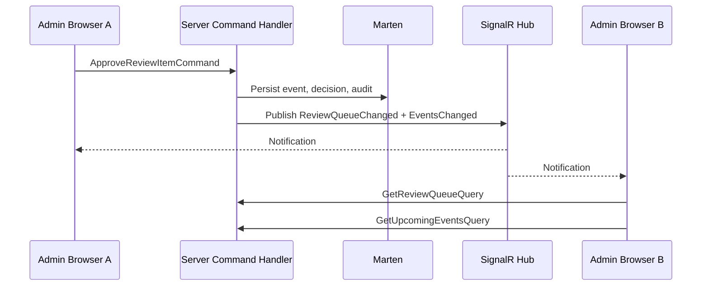
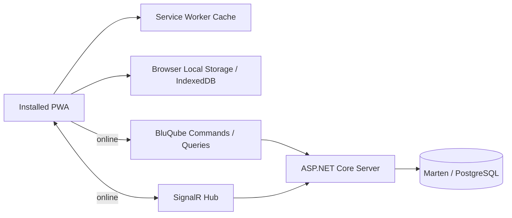
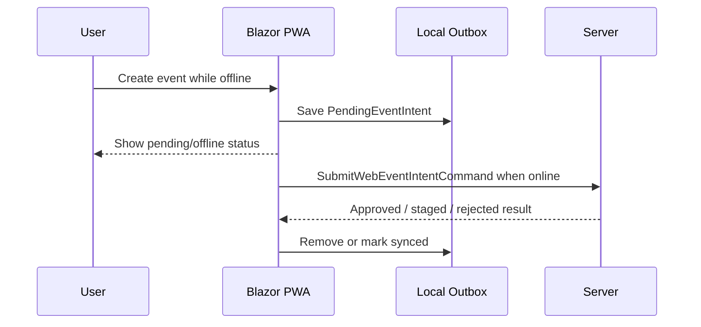
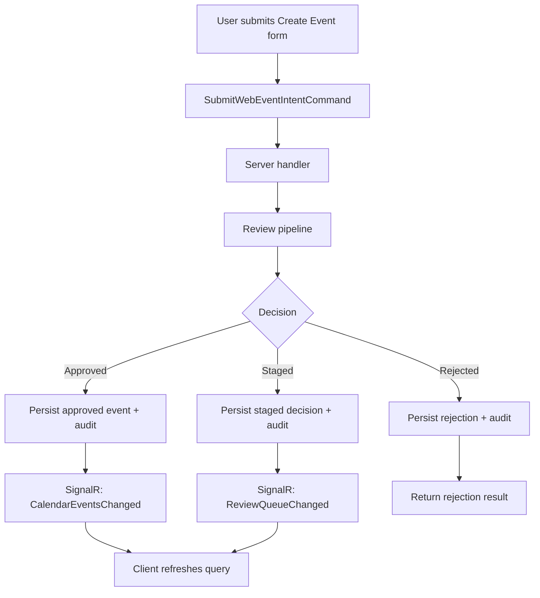

# Hearth Calendar UI Stack

This document defines the first UI and client/server communication architecture.

The selected stack is:

- Blazor WebAssembly for the browser client
- Progressive Web App support for installability and offline caching
- ASP.NET Core for the server host, auth, domain policy, persistence, and integration endpoints
- BluQube for typed commands and queries between client and server
- SignalR for push notifications that keep the web UI fresh
- Marten/PostgreSQL as the source of truth

## Principles

- The server owns calendar policy, persistence, auth, and audit.
- The WASM client owns interaction, presentation state, and optimistic UI where safe.
- The PWA app shell and selected read models can be available offline.
- BluQube commands and queries are the default path for client/server request-response work.
- SignalR broadcasts state-change notifications; it does not become a second command API.
- Offline writes must be constrained to safe queued intent submission unless a later conflict model supports more.
- Client-owned request/result contracts should stay small and serializable.
- Client-owned request/result contracts must not reference server domain types.
- Server-only dependencies such as Marten, ASP.NET middleware, handlers, processors, validators, and authorizers stay off the WASM client.

## Hosted WASM Shape



Recommended project shape:

```text
src/
  HearthCalendar.Server/
    Domain/
    Features/
      Intake/
      Review/
      Events/
      Feeds/
      Auth/
    Infrastructure/
      Marten/
      SignalR/
    Program.cs

  HearthCalendar.Client/
    Contracts/
      Ui/
    Features/
      Review/
      Events/
      Calendar/
      Auth/
    Program.cs

tests/
  HearthCalendar.Tests/
```

The split is practical rather than ceremonial:

- `Client` contains BluQube commands, queries, result records, DTOs, Blazor components, browser-side services, route pages, and UI state.
- `Server` contains the domain model, handlers, processors, validators, authorizers, Marten access, domain services, SignalR hubs, and integration endpoints.
- Server handlers/processors translate client DTO values into server domain concepts at the boundary.

## BluQube Boundary



BluQube should be used for:

- submitting event intent from the web UI
- approving, editing, and rejecting review items
- loading the review queue
- loading upcoming events
- loading event detail and audit history
- managing credentials and feed tokens through admin screens

BluQube should not be used for:

- Home Assistant's public API endpoint if a stable external HTTP contract is clearer
- ICS feed endpoints
- low-level CalDAV protocol endpoints
- SignalR hub messages

## Source Generation Setup

Server entry point:

```csharp
[BluQubeResponder]
public static class Program
{
    public static void Main(string[] args)
    {
        var builder = WebApplication.CreateBuilder(args);

        builder.Services.AddBluQube(typeof(Program).Assembly);
        builder.Services.AddBluQubeAuthorization(typeof(Program).Assembly, options =>
        {
            options.RequireAuthorizationByDefault = true;
        });

        var app = builder.Build();
        app.AddBluQubeApi();
        app.Run();
    }
}
```

Client entry point:

```csharp
[BluQubeRequester]
public static class Program
{
    public static async Task Main(string[] args)
    {
        var builder = WebAssemblyHostBuilder.CreateDefault(args);

        builder.Services.AddScoped<ICommandRunner, CommandRunner>();
        builder.Services.AddScoped<IQueryRunner, QueryRunner>();
        builder.Services.AddHttpClient(
            "bluqube",
            client => client.BaseAddress = new Uri(builder.HostEnvironment.BaseAddress));
        builder.Services.AddBluQubeRequesters();

        await builder.Build().RunAsync();
    }
}
```

The real implementation should also register:

- FluentValidation validators
- BluQube JSON converters
- command/query handlers and processors
- BluQube authorizers
- auth state services for the WASM client

## Commands

Commands modify state and should usually return enough data for the UI to update immediately.

| Command | Result | Notes |
| --- | --- | --- |
| `SubmitWebEventIntentCommand` | `SubmitWebEventIntentResult` | Sends manual UI entry through the same review pipeline as other sources. |
| `ApproveReviewItemCommand` | `ApproveReviewItemResult` | Creates or updates approved event state. |
| `RejectReviewItemCommand` | `RejectReviewItemResult` | Rejects staged item and writes audit entry. |
| `EditReviewItemCommand` | `EditReviewItemResult` | Applies edits, reruns validation/clash checks. |
| `DeleteEventCommand` | `DeleteEventResult` | Requires exact-match domain policy. |
| `RescheduleEventCommand` | `RescheduleEventResult` | Updates existing event; must avoid duplicate creation. |
| `CreateClientCredentialCommand` | `CreateCredentialResult` | Returns raw secret once. |
| `RotateClientCredentialCommand` | `RotateCredentialResult` | Returns new raw secret once. |
| `RevokeClientCredentialCommand` | `RevokeCredentialResult` | Revokes without deleting audit history. |
| `CreateFeedTokenCommand` | `CreateFeedTokenResult` | Returns raw feed token once. |

Example client-owned command:

```csharp
[BluQubeCommand(Path = "commands/review/approve")]
public sealed record ApproveReviewItemCommand(Guid ReviewDecisionId)
    : ICommand<ApproveReviewItemResult>;
```

## Queries

Queries read state and should return screen-focused DTOs.

| Query | Result | Notes |
| --- | --- | --- |
| `GetReviewQueueQuery` | `ReviewQueueResult` | Staged items with suggestions, reasons, clashes. |
| `GetUpcomingEventsQuery` | `UpcomingEventsResult` | Approved events filtered by date range/calendar. |
| `GetEventDetailQuery` | `EventDetailResult` | Event metadata, participants, source, decision, audit trail. |
| `GetAuditTrailQuery` | `AuditTrailResult` | Admin audit view. |
| `GetCredentialListQuery` | `CredentialListResult` | Credential metadata only, never raw tokens. |
| `GetFeedTokenListQuery` | `FeedTokenListResult` | Feed token metadata only. |

Example client-owned query:

```csharp
[BluQubeQuery(Path = "queries/review/queue", Method = "GET")]
public sealed record GetReviewQueueQuery : IQuery<ReviewQueueResult>;
```

## Validation And Authorization

Validation:

- Commands use FluentValidation through BluQube command handlers.
- Query validation is handled inside processors when needed.
- Validation errors should be rendered in the Blazor UI without losing form state.

Authorization:

- BluQube authorization should require authorization by default.
- Each protected command/query should have an `IBluQubeAuthorizer<TRequest>`.
- Login or bootstrap commands that must be anonymous should explicitly implement `IAllowAnonymousBluQubeRequest`.
- Admin UI commands and queries require `admin:web`.
- Credential-management commands require `credentials:manage`.

This aligns with the auth stack's secure-by-default endpoint policy.

## SignalR Boundary

SignalR exists to tell open browser sessions that state changed.



SignalR messages should be small notifications, not full domain payloads.

Recommended messages:

| Message | Meaning | Client Reaction |
| --- | --- | --- |
| `ReviewQueueChanged` | Staged item count or contents changed. | Refresh review queue query. |
| `CalendarEventsChanged` | Approved event views changed. | Refresh current calendar/upcoming query. |
| `EventDetailChanged` | A specific event changed. | Refresh detail page if viewing that event. |
| `AuditTrailChanged` | Audit entries changed. | Refresh audit view if open. |
| `CredentialsChanged` | Credential metadata changed. | Refresh credential admin view. |

SignalR messages should include:

- message type
- affected IDs where useful
- server timestamp
- correlation ID where available

They should not include:

- raw credentials
- full audit payloads
- authorization-sensitive details
- AI provider request/response payloads

## PWA And Offline Caching

The Blazor WASM client should be installable as a PWA.

Authored browser assets live outside generated static output:

- `src/HearthCalendar.Client/Assets/Styles/*.scss` for SCSS
- `src/HearthCalendar.Client/Assets/Scripts/*.ts` for TypeScript browser modules and service workers
- `src/HearthCalendar.Client/Assets/Pwa/` for the Blazor host page, manifest, and icons

`npm run build:assets` compiles SCSS and TypeScript, then copies PWA assets into `src/HearthCalendar.Client/wwwroot`. The Blazor client project runs this target before static web assets are resolved, so `dotnet build` receives a generated `wwwroot` without requiring that folder to be committed. Run `npm ci` from the repository root after cloning or when Node dependencies change.

Offline support has two layers:

- app shell caching so the UI can open without a network connection
- local browser storage for selected read models and safe pending work



### Offline Data

Cache locally:

| Data | Offline Use | Refresh Source |
| --- | --- | --- |
| app shell/assets | open installed app | service worker |
| upcoming events | read-only calendar view | `GetUpcomingEventsQuery` |
| review queue summary | show stale/offline snapshot | `GetReviewQueueQuery` |
| event details recently viewed | read-only detail view | `GetEventDetailQuery` |
| pending event intents | queue safe submissions | local outbox |

Do not cache locally:

- raw credentials
- raw feed tokens
- admin passwords
- AI provider prompts/responses beyond what the review queue intentionally displays
- long-lived authorization headers

### Offline Commands

Offline command handling should be intentionally narrow.

| Action | Offline Behaviour |
| --- | --- |
| Create event intent | Allow as queued pending intent. Submit when online. |
| Edit unsubmitted local intent | Allow before sync. |
| Approve review item | Require online fresh state. |
| Reject review item | Require online fresh state. |
| Delete event | Require online fresh state and exact server-side match. |
| Reschedule event | Require online fresh state and server-side clash checks. |
| Manage credentials | Require online. |

Queued event intents should be displayed clearly as pending and not shown as approved calendar events until the server accepts and reviews them.

### Local Outbox

The client can keep a small local outbox for offline event creation.



Local outbox records should include:

- local ID
- raw text/form fields
- created time
- last sync attempt time
- sync status
- failure reason when available

They should not include server decisions until the server has processed them.

### PWA Security Notes

The PWA must work within the app's CORS and Content Security Policy configuration.

Requirements:

- service worker and manifest assets are allowed by CSP
- SignalR reconnect endpoints are allowed by `connect-src`
- BluQube endpoints are allowed by `connect-src`
- deployed WASM origins are included in the server CORS allowed-origin list
- local development origins are not copied into production CORS settings
- offline caches do not contain raw credentials or feed tokens

### Staleness And Conflict Rules

Offline views must be marked as potentially stale.

When the app reconnects:

- reconnect SignalR
- refresh active screen queries through BluQube
- submit queued safe intents
- show server decisions for queued submissions
- leave unsafe actions disabled until current server state is loaded

The server remains the source of truth. The client should never approve an event, resolve a clash, delete, or reschedule based only on cached state.

## UI Screens

Initial screens:

| Screen | Primary Queries | Primary Commands | SignalR Refresh |
| --- | --- | --- | --- |
| Review Queue | `GetReviewQueueQuery` | approve, edit, reject | `ReviewQueueChanged`, `CalendarEventsChanged` |
| Upcoming Events | `GetUpcomingEventsQuery` | delete, reschedule | `CalendarEventsChanged` |
| Event Detail | `GetEventDetailQuery` | edit, delete, reschedule | `EventDetailChanged`, `AuditTrailChanged` |
| Create Event | none initially | `SubmitWebEventIntentCommand` | `ReviewQueueChanged`, `CalendarEventsChanged` |
| Audit Log | `GetAuditTrailQuery` | none initially | `AuditTrailChanged` |
| Credentials | credential/feed token list queries | create, rotate, revoke | `CredentialsChanged` |

## Web UI Event Flow



## External HTTP APIs

Home Assistant intake can stay as explicit HTTP API endpoints instead of BluQube commands because it is an external integration contract.

Recommended split:

- Web UI uses BluQube.
- Home Assistant uses `/api/intake/home-assistant/event`.
- ICS feeds use `/feeds/{calendar}.ics`.
- CalDAV uses `/caldav/*`.

All of these still call the same server-side domain services and persist to the same Marten documents.

## Acceptance Criteria

- Blazor WASM client uses BluQube command/query runners for web UI server calls.
- Blazor WASM client is PWA-ready with app shell caching.
- BluQube request/result records and UI DTOs live in the client project.
- Client-owned BluQube contracts do not reference server domain types.
- BluQube handlers, processors, validators, authorizers, and Marten access live on the server.
- BluQube authorization requires authorization by default.
- SignalR is used for push notifications after persisted changes.
- SignalR hub methods do not perform calendar mutations.
- Clients refresh screen data through BluQube queries after receiving SignalR notifications.
- Offline mode supports cached read-only views and queued new event intents.
- Offline mode does not approve, reject, delete, or reschedule events without server confirmation.
- Home Assistant, ICS, and CalDAV contracts remain explicit external endpoints.
- Raw credentials and feed tokens are never sent over SignalR.
- Raw credentials and feed tokens are not stored in offline browser caches.
- UI screens can be mapped to named commands, queries, and notification messages.
